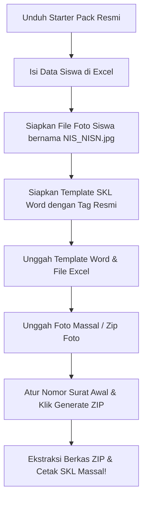

# 🎓 SKL Generator - Aplikasi Pembuat Surat Keterangan Lulus Massal (Offline-First SPA)

Aplikasi berbasis web satu halaman (**Single Page Application**) modern untuk menghasilkan **Surat Keterangan Lulus (SKL)** secara massal secara instan dan aman. Aplikasi ini berjalan **100% Client-Side (Offline-First)** di dalam browser pengguna tanpa memerlukan server backend, sehingga menjamin kerahasiaan dan keamanan data sensitif siswa Anda.

Dikembangkan secara profesional oleh **WiraWebSolusi** dengan mengedepankan estetika premium modern (*Glassmorphism Design*), presisi tata letak ponsel (*Mobile-First Design*), dan performa berkecepatan tinggi.

---

## 💎 Fitur Unggulan

### 1. 🛡️ Keamanan Data Mutlak (Offline-First)
Semua pemrosesan file Excel, pencocokan foto, dan injeksi template Word (.docx) dilakukan secara lokal di memori browser Anda. Tidak ada satu pun bit data atau foto siswa yang diunggah ke internet/server eksternal.

### 2. 📸 Auto Aspect-Ratio Resizer (Smart Center-Crop)
Sistem pemeta foto cerdas kami secara otomatis mendeteksi ukuran bingkai gambar `{foto}` pada template Word Anda. Ukuran foto siswa apa pun yang Anda unggah (seperti rasio 3x4, 4x6, dsb) akan otomatis dipotong secara terpusat (*center-crop*) menyesuaikan rasio bingkai template tanpa membuat wajah siswa menjadi **gepeng, peyang, atau melar**!

### 3. 📅 Smart Date Parser (Excel Serial & Text Converter)
Aplikasi ini dilengkapi pendeteksi tanggal cerdas yang otomatis mengonversi serial angka mentah tanggal bawaan Microsoft Excel (misal: `41732`) maupun teks tanggal tidak beraturan menjadi format penulisan tanggal formal Indonesia yang baku secara otomatis (contoh: `12 Mei 2026`).

### 4. 🔢 Sequential Letter Numbering
Sistem penomoran surat otomatis yang urut secara urutan baris data. Cukup gunakan tag `{no_urut_padded}` (2 digit: 01, 02) atau `{no_urut_padded_3}` (3 digit: 001, 002) di Word Anda. Anda hanya perlu menyetel nomor awal surat di panel generator!

### 5. 🔍 Pencarian & Pengurutan Instan (Compact Table view)
Dilengkapi dengan bilah pencarian responsif dan pengurutan cerdas (berdasarkan Nama A-Z, Z-A, maupun status kelengkapan Foto) pada tabel siswa dengan fitur gulir vertikal terpadu (*vertical scrolling*) untuk kenyamanan navigasi hingga ribuan baris data siswa.

### 6. 📋 Portal Panduan Instan (Click-to-Copy)
Dilengkapi banner petunjuk aturan mutlak penggunaan tag bawaan di bagian atas halaman. Cukup klik sekali pada tag yang Anda inginkan, dan tag tersebut akan otomatis tersalin ke clipboard Anda secara instan dengan notifikasi toast yang interaktif.

---

## 📑 Aturan Mutlak Penulisan Tag Word Template

> [!IMPORTANT]
> Mesin injeksi data kami mencari kecocokan karakter secara **100% presisi dan sensitif (case-sensitive & character-precise)**. Anda **dilarang keras** mengubah ejaan kata, mengubah huruf kecil menjadi huruf kapital, atau menambahkan spasi di dalam kurung kurawal bawaan. 

Tuliskan tag-tag berikut persis apa adanya di dalam file Word (.docx) Anda:

| Nama Tag | Deskripsi Fungsi di Word | Sumber Kolom Excel |
| :--- | :--- | :--- |
| **`{nama}`** | Menampilkan Nama Lengkap Siswa | Kolom `nama` |
| **`{tempat}`** | Menampilkan Tempat Lahir Siswa | Kolom `tempat` |
| **`{tanggal_lahir}`** | Menampilkan Tanggal Lahir (Otomatis formal) | Kolom `tanggal_lahir` |
| **`{nama_ortu}`** | Menampilkan Nama Orang Tua/Wali | Kolom `nama_ortu` |
| **`{nis_nisn}`** | Menampilkan Nomor Induk Siswa & NISN | Kolom `nis_nisn` |
| **`{no_peserta}`** | Menampilkan Nomor Peserta Ujian | Kolom `no_peserta` |
| **`{tahun_pelajaran}`**| Menampilkan Tahun Pelajaran | Kolom `tahun_pelajaran` |
| **`{foto}`** | Menampilkan Bingkai Pas Foto Otomatis (Rasio Fleksibel) | Dipetakan dari nama file foto |
| **`{no_urut_padded}`**| Menampilkan Nomor Urut Surat otomatis (e.g. `01`, `02`) | Berdasarkan baris data + nomor awal surat |

> [!WARNING]
> Mengubah `{nama}` menjadi **`{NAMA}`** atau `{nama_ortu}` menjadi **`{NamaOrangTua}`** dipastikan akan membuat mesin generator gagal mendeteksi tag tersebut, sehingga data siswa pada hasil cetak dokumen Word Anda akan **tercetak tetap kosong**.

---

## 🚀 Alur Kerja Pembuatan SKL Massal

### Langkah 1: Persiapan Dokumen
1. Klik tombol **Starter Pack** di aplikasi untuk mengunduh template Excel dan Word resmi.
2. Isi kolom data siswa pada berkas Excel tanpa mengubah nama header kolom bawaan.
3. Siapkan pas foto siswa dengan format nama file menggunakan **NIS/NISN** siswa (Contoh: `12345678.jpg` atau `12345678.png`).

### Langkah 2: Unggah Berkas ke Sistem
1. Unggah berkas template Word Anda pada kolom **"Upload Template Word (.docx)"**.
2. Unggah berkas Excel data siswa pada kolom **"Upload Data Excel (.xlsx)"**.
3. Unggah seluruh foto siswa secara bersamaan (*multiple-select*) atau seret langsung ke kolom **"Upload Foto Siswa (Massal)"**.

### Langkah 3: Cetak Dokumen
1. Cek status kebersihan data pada tabel siswa di bagian bawah. Pastikan indikator foto berlabel 📸 **MATCHED**.
2. Setel nomor urut awal surat pada input yang disediakan (contoh: nomor urut surat awal `12` untuk format `Nomor: 422 / 012 / SKL / SDN-FKT / 2026`).
3. Klik tombol **Generate ZIP Berkas SKL**. Sistem akan memproses seluruh data secara instan dan mengunduh berkas `.zip` berisi ratusan berkas SKL berformat Word hasil injeksi data yang rapi dan siap dicetak!

---

## 🛠️ Spesifikasi Teknologi & Dependensi

Aplikasi ini dikembangkan menggunakan tumpukan teknologi modern murni client-side:
*   **Tailwind CSS CDN** - Penyusun antarmuka modern yang responsif dan berestetika tinggi.
*   **Alpine.js v3** - Kerangka kerja JavaScript reaktif super ringan untuk penanganan state.
*   **PizZip & docxtemplater** - Mesin pembaca dan penulis XML untuk file dokumen `.docx` secara offline.
*   **SheetJS (xlsx.full.min.js)** - Mesin parser tangguh untuk membaca lembar kerja Excel secara instan.
*   **JSZip & FileSaver.js** - Pengepak berkas keluaran menjadi arsip `.zip` dan pengunduh file lokal.
*   **SweetAlert2** - Kotak pesan pop-up interaktif untuk notifikasi sistem yang elegan.

---

## 🤵 Kontributor & Dukungan Teknis

Aplikasi ini dirancang dan disempurnakan oleh:
🌐 **WiraWebSolusi** - *Jasa Pembuatan Website & Aplikasi Web Profesional.*

Jika Anda menemukan kendala teknis atau membutuhkan kustomisasi fitur tambahan, silakan hubungi tim kami melalui portal layanan pelanggan resmi kami di [wirawebsolusi.site](https://about-wrwn.site/).

*Hak Cipta © 2026 WiraWebSolusi. Seluruh hak cipta dilindungi undang-undang.*
